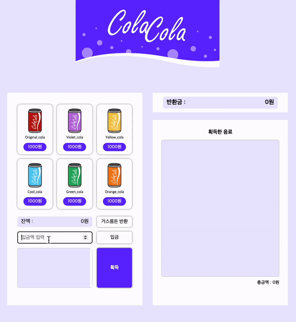
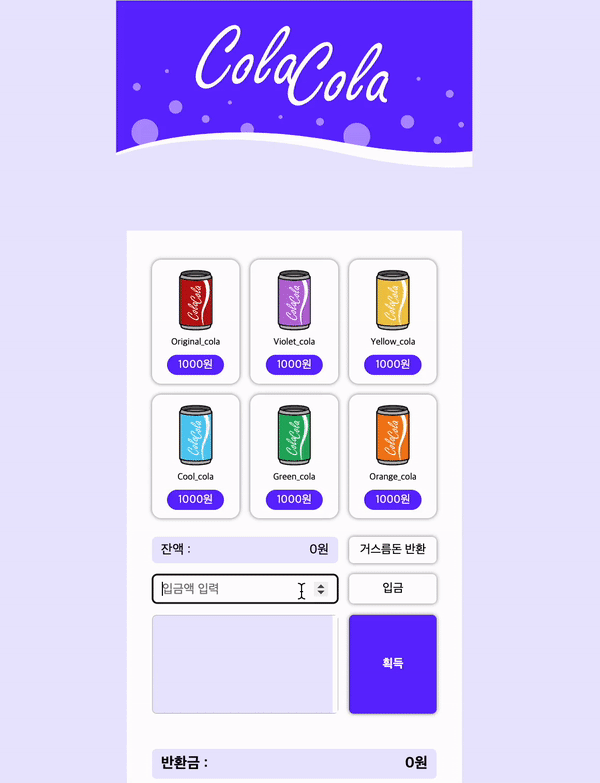

# <a href='https://hongryeoll.github.io/Vending_machine/'>Vending_machine</a>

|                            웹                             |                            모바일                           |
| :---------------------------------------------------------------: | :---------------------------------------------------------------: |
|  |  |

----
## 기술 스택
- HTML
- CSS
- JavaScript

## 적용 기법
- JSON으로 콜라 정보 반영.

## 구현 기능

1. 금액 입력 후 입금 클릭
- 입금 전 클릭 이미지 클릭 불가.
- 입금 후 잔액에 금액 표시.
2. 메인 화면 콜라 이미지 클릭
- 클릭한 콜라는 하단 장바구니에 등록.
3. 한 번에 동일 종류 콜라 10개 장바구니에 등록
- 해당 콜라 매진.
- 매진된 콜라는 클릭 불가.
4. 장바구니에 있는 cola 수량 변경
- 콜라 클릭시 수량 감소.
5. 획득 클릭
- 장바구니에 등록된 콜라 획득.
- 잔액과 콜라 수량을 비교하여 잔액 부족시 경고창 출력.
6. 획득한 콜라 표시
- 성공적으로 획득시 획득한 음료 list에 표시.
- 총금액에 구매된 금액 표시.
7. 반환 클릭.
- 잔액은 0원으로 표시되며, 반환금에 금액 추가.